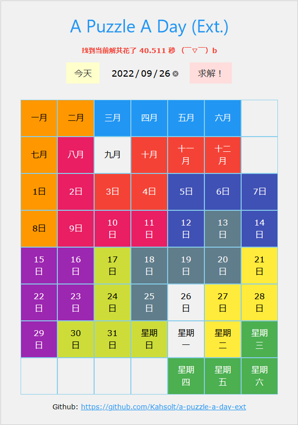
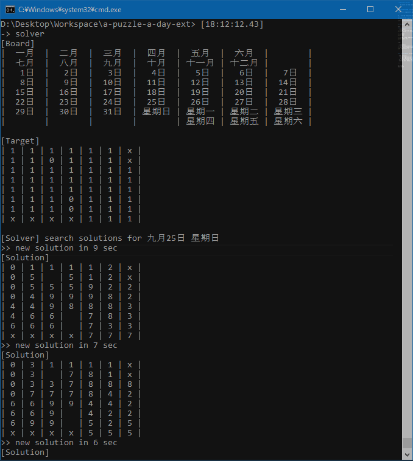

# a-puzzle-a-day-ext

    A solver for the version of A-Puzzle-A-Day game extended with day-of-the-week

----




话说 **2022年8月12日星期五**，友人A给我买个了拼图解谜游戏。它是 DragonFlord 游戏原版的增强版，长得像这样：


我们一起拼了一晚上，嗯是没把那一天的日期拼出来。

这是否有点严重侮辱我高达114514的智商？🤔……淦！我必须立gu即dao行xian动zai——

今天是 **2022年9月25日星期日** ，wrnm终于有时间写完了……（完结撒花！


### Quickstart

c版: 

```powershell
// 先编译一下，直接 make 也行
gcc.exe solver.c -o solver.exe

// 今日查询
solver.exe

// 指定日期查询: 五月 27日 星期三
solver.exe 5 27 3
```

会不断地枚举所有可行解……这确实太多了🤔，但我人手怎么就碰不了运气呢？



js版: 

```powershell
// 可以在命令行运行，感觉上比c慢一些
node.exe solver.js
node.exe solver.js 11 45 14

// 也可以在浏览器里查看，但是很慢很慢（甚至需要一分钟）；感觉完全可以用作浏览器性能测试
firefox.exe index.html
```

已经部署在了 [https://kahsolt.pythonanywhere.com/a-puzzle-a-day](https://kahsolt.pythonanywhere.com/a-puzzle-a-day) 上，可以直接访问（但真的好慢啊(lll￢ω￢)……


#### Ref: solvers for the original [DragonFlord's version](https://www.dragonfjord.com/product/a-puzzle-a-day/)

- HTML:
  - https://github.com/robertjajajja/a-puzzle-a-day, [Try it Online](https://robertjajajja.github.io/a-puzzle-a-day/)
  - https://github.com/x6ud/a-puzzle-a-day
- Go: https://github.com/gonejack/a-puzzle-a-day
- Android: https://github.com/wzy820715/A_Puzzle_A_Day

----

by Armit
2022/08/27 
